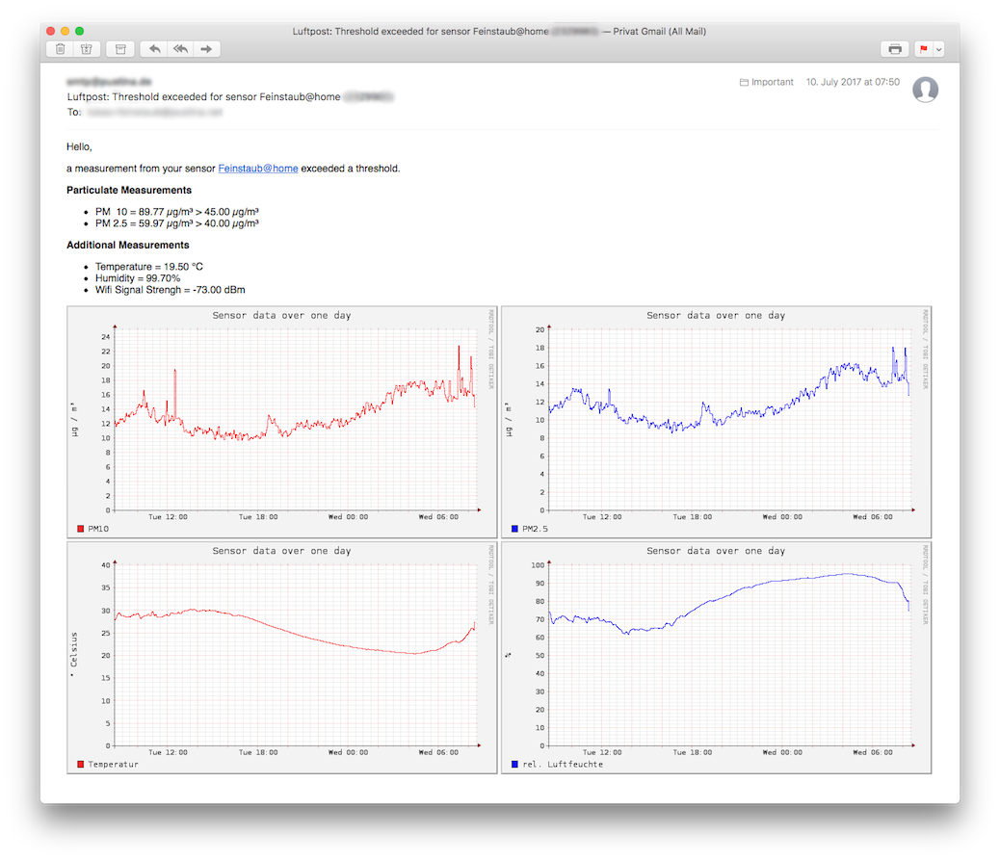

# luftpost

Watches [luftdaten.info](http://luftdaten.info) particulates sensors and sends E-Mails if measurements exceed thresholds.

[](https://travis-ci.org/lukaspustina/luftpost) [](https://ci.appveyor.com/project/lukaspustina/luftpost/branch/master) [](https://github.com/lukaspustina/luftpost/releases) [](https://crates.io/crates/luftpost) [](https://galaxy.ansible.com/lukaspustina/luftpost/) [](./LICENSE)

[luftdaten.info](http://luftdaten.info) offers a very easy do-it-yourself instruction on how to build an inexpensive yet powerful particulates sensor together with a fully functional firmware. This firmware regularly measures the particulates concentration and transmits the resulting data to luftdaten.info where it is processed and displayed on a world map. Even though most sensors are deployed in [Germany](http://deutschland.maps.luftdaten.info/#6/51.165/10.455) you can find sensors [all over the world](http://deutschland.maps.luftdaten.info/#8/-0.811/36.781).

_luftpost_ is a simple program that monitors luftdaten.info sensors and notifies you via E-Mail in case a particulates concentration measurement exceeds a thresholds. The E-Mail is nicely formatted and may contain the very same graphs that luftdaten.info offers -- see below for an example. The notification can be triggered to be send on every measurement, only when a measurement exceeds a threshold, or on changes only, i.e., once after exceeding a threshold and then after returning back below a threshold -- see the [Configuration](#configuration) section for details.

There are binaries for Linux, Raspberry Pi, and Windows as well as Debian packages for and a Homebrew recipe. Furthermore, there is an Ansible role for easy installation on Linux and Raspberry Pi -- see the [Installation](#Installation) section for details.

<p align="center"></p>

<!-- START doctoc generated TOC please keep comment here to allow auto update -->
<!-- DON'T EDIT THIS SECTION, INSTEAD RE-RUN doctoc TO UPDATE -->
**Table of Contents**

- [Configuration](#configuration)
- [Installation](#installation)
  - [Ubuntu [x86_64 and Raspberry Pi]](#ubuntu-x86_64-and-raspberry-pi)
  - [Linux Binaries [x86_64 and Raspberry Pi]](#linux-binaries-x86_64-and-raspberry-pi)
  - [Windows Binaries [x86_64 and i686]](#windows-binaries-x86_64-and-i686)
  - [macOS](#macos)
  - [Sources](#sources)
  - [Ansible](#ansible)
- [Future Work](#future-work)

<!-- END doctoc generated TOC please keep comment here to allow auto update -->

## Configuration

Please see this [example](tests/luftpost.example.conf) for a full description of all available configuration parameters. This [example](test/luftpost-minimal.example.conf) shows the minimal configuration required to run _luftpost_.

_luftpost_ uses the [Handlebars](https://handlebarsjs.com) templating language provided through [handlebars-rust](https://github.com/sunng87/handlebars-rust). Please mind that handlebars-rust has a few [limitations](https://github.com/sunng87/handlebars-rust#limitations) compared to the original JavaScript Handlebars implementation. Please check the respective documentation if you want to develop your own templates.

## Installation

### Ubuntu [x86_64 and Raspberry Pi]

Please add my [PackageCloud](https://packagecloud.io/lukaspustina/opensource) open source repository and install _luftpost_ via apt.

```bash
curl -s https://packagecloud.io/install/repositories/lukaspustina/opensource/script.deb.sh | sudo bash
sudo apt-get install luftpost
```

### Linux Binaries [x86_64 and Raspberry Pi]

There are binaries available at the GitHub [release page](https://github.com/lukaspustina/luftpost/releases). The binaries get compiled on Ubuntu.

### Windows Binaries [x86_64 and i686]

There are binaries available at the GitHub [release page](https://github.com/lukaspustina/luftpost/releases).

### macOS

Please use [Homebrew](https://brew.sh) to install _luftpost_ on your system.

```bash
brew install lukaspustina/os/luftpost
```

### Sources

Please install Rust via [rustup](https://www.rustup.rs) and then run

```bash
cargo install luftpost
```

### Ansible

There is also an Ansible role available at [Ansible Galaxy](https://galaxy.ansible.com/lukaspustina/luftpost/) that automates the installation of _luftpost_.


## Future Work

  * Move sending E-Mails to futures once lettre 0.7 is released

  * Maybe support for directly queuering a sensor

